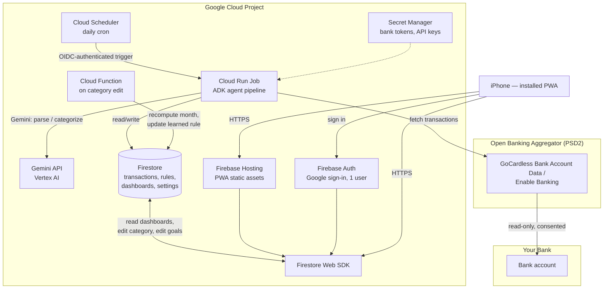
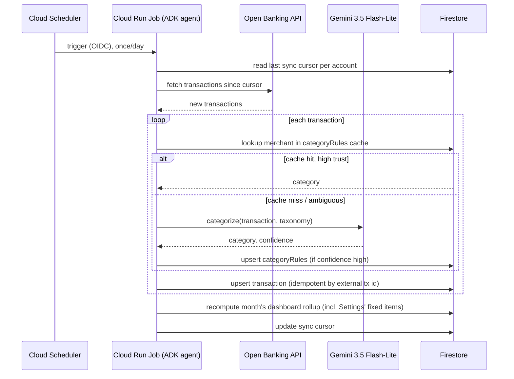

# Architecture Design — Home Finance Agent

Status: **Phase 1 built** — an ADK agent categorizes on import (manual CSV
input still). Backend (`functions/`) is Python; PWA (`app/`) is
TypeScript. Last updated 2026-09-13.

## 1. Goal & scope

Build a personal system that, once a day:

1. Pulls new bank transactions automatically (open banking, no manual export).
2. Categorizes each transaction, learning from corrections over time instead
   of re-guessing every merchant.
3. Maintains a monthly dashboard: spend by category, savings-goal progress,
   and money left (income − expenses − fixed items − savings goal).
4. Is reachable from an iPhone as an installable app.

This is a joint-account budget, not a single-salary one: only one partner's
salary typically lands in the tracked account, and some recurring costs
(e.g. rent) are paid from a different account entirely and never appear as
a transaction here at all. §6–§8 cover how the data model accounts for
that — a general "fixed monthly items" mechanism (Settings-configured, not
detected) rather than assuming every relevant amount shows up in this
account's statement.

Single user, low transaction volume (tens–low hundreds/month), no real-time
requirement. That last point matters: it rules out several "always-on"
patterns and makes the cheapest, most boring option the right one almost
everywhere.

## 2. High-level architecture



Two independent halves, joined only by Firestore:

- **Batch pipeline** (server-side, once a day): sync → parse → categorize →
  store → aggregate. Nothing here is user-facing or latency-sensitive.
- **Dashboard app** (client-side, on-demand): a PWA that reads/writes
  Firestore directly through the Firebase Web SDK — no custom API server
  needed for the parts that are just CRUD, which removes an entire service
  to run, patch, and pay for.

## 3. Why these building blocks

### 3.1 Agent framework: Google ADK — as a library, not deployed to Agent Engine

Google's stack offers two layers here and it's worth separating them:

- **ADK (Agent Development Kit)** — an open-source (Apache-2.0) Python/Go/
  Java/TS framework for structuring an agent as a model + a set of typed
  tools + orchestration/tracing. This is a **code structure**, not a hosting
  choice — the same agent can run locally, in a container, or managed.
- **Vertex AI Agent Engine** — a managed *runtime* for agents (ADK,
  LangGraph, CrewAI, …) with autoscaling, sessions, and a "Memory Bank"
  for long-lived conversational memory.

Agent Engine earns its cost for **interactive, multi-turn, long-lived
conversational agents** — it bills stored session events/memories
($0.25 per 1,000, since Feb 2026) on top of vCPU/GB-hour runtime, which
is money spent on a capability (durable multi-turn memory across a chat UI)
this pipeline doesn't need: it's one deterministic batch run a day with no
back-and-forth conversation.

**Recommendation:** build the pipeline as an ADK agent (tools = fetch
transactions, categorize, write to Firestore, recompute dashboard — see
§5) for the structure, tracing, and testability ADK gives you, but run it
as a plain **Cloud Run Job** invoked by Cloud Scheduler, not deployed onto
Agent Engine. A few minutes of compute once a day sits inside Cloud Run's
always-free tier; Agent Engine's session/memory billing buys you nothing
here.

Keep Agent Engine in your back pocket for a genuine future use case:
a **"ask your finances"** chat feature in the dashboard ("how much did I
spend on dining out in June vs May?") is exactly the interactive,
session-carrying agent Agent Engine is built for. That's a clean phase-3
add-on (§8), not part of the MVP.

### 3.2 Model choice: cheapest tier that clears the bar, with escalation for the hard cases

The task per transaction is bounded classification (pick 1 of ~14 known
categories + a boolean), plus, for statement parsing, structured extraction
from tabular/PDF input — neither needs frontier reasoning.

Current Gemini lineup and pricing (per 1M tokens, input/output; Sep 2026):

| Model | Input | Output | Fit |
|---|---|---|---|
| Gemini 3.1 Pro | $2.00 | $12.00 | Overkill — reserve for nothing in this project |
| Gemini 3.x Flash (3.5–3.8) | $0.75–$1.50 | $3.75–$7.50 | Good, but pricier than needed for pure classification |
| **Gemini 3.5 Flash-Lite (GA)** | **$0.30** | **$2.50** | **Default for this project** |
| Gemini 2.5 Flash-Lite | $0.10 | $0.40 | Fallback if Flash-Lite 3.5 proves unnecessary for accuracy |

**Recommendation:** **Gemini 3.5 Flash-Lite** for both statement parsing and
categorization, called through Vertex AI (keeps everything in one GCP
project/billing/IAM boundary, no separate API key to manage). Add one
cheap reliability trick instead of reaching for a bigger model:

- **Confidence-gated escalation** — the categorization tool asks for a
  `confidence` field in its structured output; anything below a threshold
  (or any transaction the merchant-rule cache and the model disagree on)
  gets a second pass on a stronger model (Gemini 3.x Flash) or is simply
  flagged `needs_review` and shown to you in the dashboard to confirm once.
  At tens of transactions a month, this costs cents either way — the point
  is to spend the extra tokens only where they change the answer.
- **Merchant-rule cache** (§5) means most transactions never hit the model
  at all after the first month, once recurring merchants (your supermarket,
  utility company, phone plan) are learned.

This is the "best available that's *enough*" reading of the brief: default
to the cheapest tier that structurally fits the task, and spend more only
adaptively, on the transactions that actually need it.

### 3.3 Ingestion: open banking aggregator (PSD2)

You chose automatic sync over manual upload. In the EU this means going
through a licensed PSD2 aggregator rather than talking to your bank
directly (banks don't hand out stable personal API keys). Current options:

| Provider | Status (Sep 2026) | Notes |
|---|---|---|
| GoCardless Bank Account Data (ex-Nordigen) | **Closed to new signups** — being wound down | Only usable if you already hold credentials from before the freeze |
| **Enable Banking** | Self-serve, closest free/cheap replacement | Recommended default — confirm your specific bank is covered |
| Tink (Visa) / TrueLayer | Enterprise-priced, built for fintechs | Overkill/cost-prohibitive for a single-user personal project |

**Recommendation:** start with **Enable Banking** (or GoCardless if you
already have a grandfathered account) — confirm your bank's coverage
during setup, since exact bank support varies by provider. Whichever is
picked, the integration is the same shape:

- One-time (then periodic, per PSD2 SCA rules — typically ~90 days) consent
  flow: you authenticate with your bank once via the aggregator's hosted
  redirect; the resulting token is stored in **Secret Manager**, never in
  Firestore or code.
- The daily Cloud Run Job calls the aggregator's read-only transactions
  endpoint with a `since` cursor (last synced transaction date/id, stored
  per account in Firestore) — so it only pulls what's new.
- Treat the consent-expiry date as data: surface "reconnect your bank" as a
  dashboard banner when it's within a week of expiring, since a lapsed
  consent silently stops the daily sync otherwise.
- Keep a manual CSV/PDF upload path as a fallback tool in the agent (same
  parsing step, different source) for any account the aggregator doesn't
  cover, or for bootstrapping history before the first consent completes.

### 3.4 Data store: Firestore

A single-user, low-volume, document-shaped dataset (transactions, learned
rules, monthly rollups, settings) is a textbook Firestore fit: generous
always-free tier, native Firebase Auth + security-rules integration so the
PWA can read/write it directly with no custom API server, and no schema
migrations to run for a personal project. See §6 for the collection
layout.

### 3.5 Frontend: installable PWA on Firebase Hosting

For "an app I can access on my iPhone" without building/signing/
distributing a native app:

- A PWA (manifest.json + service worker) hosted on **Firebase Hosting**,
  added to the iPhone home screen via Safari's "Add to Home Screen" —
  opens full-screen, no browser chrome, behaves like an installed app.
- **Firebase Authentication** (Google sign-in) gates access; Firestore
  **security rules** hard-restrict every read/write to your own `uid`
  (belt-and-suspenders alongside only your account ever being granted
  access).
- The dashboard, transaction list, category edits, and savings-goal/salary
  settings all read/write Firestore directly via the client SDK — no
  backend API needed for these. A **Cloud Function** Firestore trigger
  (`onUpdate` on a transaction's category) does two things server-side:
  writes/updates the merchant → category learned rule, and recomputes that
  month's dashboard rollup — so a manual correction immediately improves
  future auto-categorization and is reflected on the dashboard.
- Charting: bar/donut for spend-by-category, a progress bar for the
  savings goal, a single "money left" stat tile — plain Recharts/Chart.js
  is more than enough; no separate BI tool needed for one user's dashboard.

## 4. Data flow (daily run)



Idempotency: every transaction is keyed by the aggregator's stable
external transaction id, so a retried or overlapping run never
double-counts — a write is always an upsert, never an append.

## 5. Categorization agent

Built with **`google-adk`** (`pip install google-adk`) — Python, not
TypeScript. The backend (`functions/`) was rewritten from Node/TypeScript
to Python for this reason specifically: Python is where ADK actually
originates and is the most mature, best-documented implementation — the
JS/TS port used in the first version of this agent is a newer port of it.
That switch was an explicit requirement, not a judgment call this project
made on its own; see the note in §3.1 on the general principle this keeps
running into (an explicit requirement isn't a tradeoff to make
unilaterally, even a well-reasoned one — it's surfaced and asked about).

A real `LlmAgent`/tool/`Runner` agent, not a bare `generate_content` call
with a JSON schema (`functions/categorize.py`):

- **`transaction_categorizer`** (`LlmAgent`) — given the merchant, amount,
  and the user's own category list, decides for itself how to reach an
  answer rather than following one hardcoded path.
- **`list_recently_categorized_merchants`** tool — a plain Python function
  passed directly in `tools=[...]` (ADK auto-wraps it; no explicit
  `FunctionTool()` needed for a simple case like this). The agent may call
  this if the merchant doesn't obviously match a category on its own, to
  see how similar merchants were categorized before (e.g. "UBER EATS" has
  no exact-match rule yet, but "UBER" → Transport does — a similarity
  judgment a rigid lookup can't make, and the reason this is a genuine
  improvement over the original design, not just a reframing of it).
- **`record_categorization`** tool — the agent commits its final
  `{category, confidence}` through a tool call, rather than free text or a
  response schema. Validates the category id itself and returns an error
  message back to the agent if it's invalid, so a hallucinated id gets a
  chance to be corrected within the same run rather than silently failing
  the whole categorization.
- Run via `InMemoryRunner` with a fresh session per call (each
  categorization is one independent, stateless decision; nothing here
  needs a durable session) — driven with `asyncio.run()` from the
  synchronous Firestore trigger handler in `main.py`, since Cloud
  Functions' Python Functions Framework dispatches triggers synchronously
  and doesn't await `async def` handlers itself.

An **exact-match cache hit** (`categoryRules/{merchantNormalized}`) is
still checked *before* the agent is ever invoked, in plain deterministic
code (`main.py` → `_auto_categorize`) — that isn't a shortcut around
"real agent work," it's recognizing that an exact string match has
nothing to reason about. What reaches the agent is specifically the part
that requires judgment: a merchant with no exact match.

| Step | Where |
|---|---|
| Exact-match cache lookup — avoids invoking the agent at all for a known merchant | `main.py` → `_auto_categorize`, `category_rules.py` → `find_exact_category_rule` |
| Agent run: optionally consult recent rules, then commit `{category, confidence}` | `categorize.py` → `categorize_transaction` |
| Cache write — only on a confident fresh guess, so an unconfirmed suggestion never becomes "ground truth" | `main.py` → `_auto_categorize` |
| Dashboard recompute — unchanged from Phase 0, just called again after a category lands | `dashboard.py` → `recompute_month` |

This is also where ADK's structure was worth having in practice, not just
in principle: `list_recently_categorized_merchants` is a tool the agent
*decides* whether to call, and the resulting design (reasoning over
similar merchants, not just exact match) is better than what the earlier
direct-call version did — it just wasn't reachable without giving the
model an actual tool-use loop to work with.

This isn't a verdict on ADK — it's a verdict on *this* task's shape. A
future step with real multi-step tool use and a model that has to decide
what to do next (bank-sync ingestion doing fetch → parse → categorize →
write as one flow, or the Phase 3 conversational agent) is exactly where
ADK's structure, tracing, and testability earn their keep again — revisit
there, not here.

Structured output (JSON schema / controlled generation, via
`responseSchema` on the Gemini call) is used rather than free-text
parsing, so a malformed or hallucinated response degrades to "leave this
transaction for manual review," never a silent bad write.

## 6. Firestore data model

```
users/{uid}
  savingsGoal: { type: "fixed"|"percent", value },
  fixedExpenses: [ { id, label, amount }, ... ]   -- e.g. rent, paid from another account;
                                                     assumed stable month to month (global, not per-month)

users/{uid}/settings/categories        (single doc)
  categories: [ { id, label, special?: "income"|"savings" }, ... ]   -- editable, seeded from §7

users/{uid}/monthlyIncome/{YYYY-MM}
  salary: number | null,                          -- manual per-month entry; null = use auto-detected
  fixedIncomes: [ { id, label, amount }, ... ]     -- e.g. a partner's salary that never lands here, per month

users/{uid}/accounts/{accountId}
  provider, consentExpiresAt, lastSyncCursor, bankName

users/{uid}/transactions/{externalTxId}
  date, amount, currency, merchantRaw, merchantNormalized,
  category, needsReview: bool, source: "auto"|"manual-edit"|"manual-import",
  confidence, month: "YYYY-MM" (the budget month — independently editable from date, see §8), accountId

users/{uid}/categoryRules/{merchantNormalized}
  category, timesConfirmed, lastUpdated

users/{uid}/dashboards/{YYYY-MM}
  salary, autoDetectedSalary, salarySource: "manual"|"auto"|"none",
  totalsByCategory: { [categoryId]: amount }, totalExpenses,
  fixedExpensesTotal, fixedIncomesTotal, savingsGoalTarget, savingsActual,
  moneyLeft, needsReviewCount, updatedAt
```

Why `monthlyIncome` is its own per-month collection rather than a field on
`users/{uid}` (global Settings): salary is exactly the kind of number you
need to review historically and trust hasn't moved — a global "default
salary" would let a value you update today silently rewrite what every
past month's dashboard shows the next time it happens to recompute. Rent
(`fixedExpenses`) stays global for now since it's assumed stable; revisit
the same way if that stops being true.

Firestore security rules: every path above scoped to
`request.auth.uid == uid` **and** the one allow-listed account email —
deny-by-default for everyone/everything else.

## 7. Default category taxonomy

A starting set, fully editable in Settings (rename, add, remove, or reset
to this list) — nothing is hardcoded in the agent, it reads the taxonomy
from `users/{uid}/settings/categories`. No needed/discretionary split —
that distinction wasn't pulling its weight in practice, so it was dropped
after Phase 0 testing:

| Category | Special role |
|---|---|
| Salary | *Excluded from spend* — feeds the salary figure (`special: "income"`) |
| Food | — |
| Transport | — |
| Needs | — |
| Invest | *Excluded from spend* — tracked against the savings goal (`special: "savings"`) |
| Entertainment | — |
| Others | Default fallback for anything uncategorized |

## 8. Dashboard contents & the "money left" formula

- Expenses by category (this month, from categorized transactions only),
  as a bar chart.
- Savings goal progress: target for the month vs amount actually moved to
  "Invest" — a comparison, not a deduction (see below).
- Income editor, right on the Dashboard, for the month being viewed: a
  salary field (manual entry, with the auto-detected transaction amount
  shown as a hint/placeholder if there is one) and an "other income" list
  (e.g. a partner's salary that never lands in this account) — both are
  per-month data (`monthlyIncome/{month}`, §6), not a global default, so
  scrolling back to an old month shows what actually applied then.
- Fixed monthly expenses (rent etc. — configured in Settings, global,
  never detected from a transaction) shown as their own list so the
  money-left number is traceable to something other than "trust me".
- **Money left** = `(salary + Σother income) − Σ(expenses) − Σfixed
  expenses` — plainly income minus real spend, where `salary` is your
  manual entry for the month if you gave one, else the auto-detected
  "income"-category transaction total, else 0 (flagged on the Dashboard
  as "not recorded" rather than silently treated as zero). The savings
  goal is **not** subtracted here — it's a target you're compared against
  via the savings meter, not a guaranteed outflow, so it shouldn't shrink
  a number that's supposed to mean "what's actually left."
- Trend view across the last N months (same rollup collection, just a
  range query) — not built yet, still a Phase 0 gap.

## 9. Security & privacy notes

- Bank tokens and any API keys live only in **Secret Manager**, read only
  by the Cloud Run Job's service account (least-privilege IAM — no other
  identity in the project can read those secrets).
- Firestore is reachable only via the client SDK from an authenticated,
  allow-listed Firebase Auth user (you), enforced in security rules — the
  Cloud Run Job's service account is the only other principal with write
  access, and only to this project's Firestore.
- No third party ever receives your data except the two you've explicitly
  chosen to: the open banking aggregator (read-only, consented, revocable)
  and the Gemini API (transaction text/PDF, for parsing/categorization —
  no bank credentials ever go there).
- Everything is encrypted in transit (TLS) and at rest (default GCP/
  Firebase encryption) with no extra setup.
- A stale/expired bank consent should fail loudly (dashboard banner + a
  Cloud Monitoring alert if the daily job errors), not silently stop
  syncing.

## 10. Cost estimate

At this volume, nearly everything sits inside Google Cloud's always-free
tiers:

| Component | Expected cost |
|---|---|
| Cloud Run Job (few minutes/day) | $0 (well under the always-free tier) |
| Cloud Scheduler (1 job) | $0 (3 jobs free) |
| Firestore (reads/writes/storage for one user) | $0 (far under the daily free quota) |
| Firebase Hosting + Auth | $0 (free tier covers a personal PWA) |
| Gemini 3.5 Flash-Lite (tens–hundreds of tx/month, mostly cache hits after month 1) | Cents/month |
| Open banking aggregator | $0–~€3/mo depending on provider tier chosen |
| Secret Manager | $0 (a handful of secrets, free tier) |

Realistic total: **under $1–2/month**, likely $0 most months.

## 11. Phased build plan

1. **Phase 0 — data model + dashboard, manual CSV import.** Stand up
   Firestore, security rules, the PWA (auth, dashboard, settings, manual
   transaction categorization UI), seeded with a CSV export you upload by
   hand. Proves the data model and UI end-to-end with zero bank-integration
   risk.
2. **Phase 1 — an ADK categorization agent, still on manual CSV input.**
   `google-adk` (Python) `LlmAgent` + tools (§5), triggered from the
   existing `on_transaction_write` Cloud Function. Validates
   categorization quality and the learned-rule cache before any bank
   credentials are in play. The backend (`functions/`) is Python; the
   PWA (`app/`) stays TypeScript, since that's what actually runs in
   Safari — see §5's note on the language switch.
3. **Phase 2 — open banking sync.** Add the aggregator consent flow, the
   daily Cloud Scheduler → Cloud Run Job trigger, and cursor-based
   incremental fetch. This is the step gated on confirming your bank's
   coverage with the chosen provider.
4. **Phase 3 (stretch) — conversational "ask your finances".** A chat
   affordance in the dashboard ("how much on dining out in June vs May?"),
   backed by the same ADK tools but this time genuinely worth deploying to
   **Vertex AI Agent Engine** for its session/memory management.

## 12. Open questions to confirm before Phase 2

- Which bank(s) and which aggregator (Enable Banking vs. any existing
  GoCardless access) — needs a coverage check for your specific bank.
- Is one "Salary" category (matching whichever partner's income actually
  lands in this account) still enough once bank sync is live, or does the
  agent need to distinguish multiple real income transactions by payer?
- `needs_review` transactions are excluded from `totalsByCategory` /
  `totalExpenses` until categorized (settled by the Phase 0 implementation)
  — revisit only if that undercounts spend in a way that's actually
  confusing in practice.

---

Sources consulted: [Google ADK overview](https://developers.googleblog.com/en/agent-development-kit-easy-to-build-multi-agent-applications/) ·
[Vertex AI Agent Builder 2026 guide](https://uibakery.io/blog/vertex-ai-agent-builder) ·
[Gemini API pricing, Sep 2026](https://www.cloudzero.com/blog/gemini-pricing/) ·
[Vertex AI pricing](https://cloud.google.com/vertex-ai/pricing) ·
[GoCardless Bank Account Data status](https://www.openbankingtracker.com/guides/free-open-banking-apis) ·
[Firebase Hosting + PWA](https://firebase.google.com/docs/hosting).
